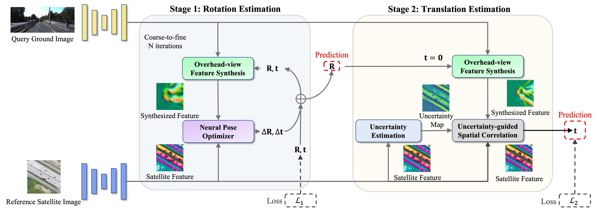

# Boosting 3-DoF Ground-to-Satellite Camera Localization Accuracy via Geometry-Guided Cross-View Transformer

Official implementation of the **ICCV 2023** paper: **[Boosting 3-DoF Ground-to-Satellite Camera Localization Accuracy via Geometry-Guided Cross-View Transformer](https://openaccess.thecvf.com/content/ICCV2023/papers/Shi_Boosting_3-DoF_Ground-to-Satellite_Camera_Localization_Accuracy_via_Geometry-Guided_Cross-View_Transformer_ICCV_2023_paper.pdf)**

[Yujiao Shi](https://yujiaoshi.github.io/), Fei Wu, [Akhil Perincherry](http://akhilperincherry.com/), Ankit Vora, and [Hongdong Li](https://users.cecs.anu.edu.au/~hongdong/)



# Abstract
Image retrieval-based cross-view localization methods often lead to very coarse camera pose estimation, due to the limited sampling density of the database satellite images. In this paper, we propose a method to increase the accuracy of a ground camera's location and orientation by estimating the relative rotation and translation between the ground-level image and its matched/retrieved satellite image.
Our approach designs a geometry-guided cross-view transformer that combines the benefits of conventional geometry and learnable cross-view transformers to map the ground-view observations to an overhead view. 
Given the synthesized overhead view and observed satellite feature maps, we construct a neural pose optimizer with strong global information embedding ability to estimate the relative rotation between them. After aligning their rotations, we develop an uncertainty-guided spatial correlation to generate a probability map of the vehicle locations, from which the relative translation can be determined.
Experimental results demonstrate that our method significantly outperforms the state-of-the-art. Notably, the likelihood of restricting the vehicle lateral pose to be within 1m of its Ground Truth (GT) value on the cross-view KITTI dataset has been improved from $35.54\%$ to $76.44\%$, and the likelihood of restricting the vehicle orientation to be within $1^{\circ}$ of its GT value has been improved from $19.64\%$ to $99.10\%$.

### Experiment Dataset
We use three existing dataset to do the experiments: KITTI, Ford-AV and Oxford RobotCar. For our collected satellite images for KITTI and Ford-AV, please first fill this [Google Form](https://forms.gle/Bm8jNLiUxFeQejix7), we will then send you the link for download. 

- KITTI: Please first download the raw data (ground images) from http://www.cvlibs.net/datasets/kitti/raw_data.php, and store them according to different date (not category). 
Your dataset folder structure should be like: 

KITTI:

  raw_data:
  
    2011_09_26:
    
      2011_09_26_drive_0001_sync:
      
        image_00:
	
	image_01:
	
	image_02:
	
	image_03:
	
	oxts:
	
      ...
      
    2011_09_28:
    
    2011_09_29:
    
    2011_09_30:
    
    2011_10_03:
  
  satmap:
  
    2011_09_26:
    
    2011_09_29:
    
    2011_09_30:
    
    2011_10_03:

- Ford-AV: The ground images and camera calibration files can be accessed from https://avdata.ford.com/downloads/default.aspx. Please follow their original structure to save them on your computer. For the satellite images, please put them under their corresponding log folder. Here is an example:


Ford:

  2017-08-04:
  
    V2:
    
      Log1:
      
        2017-08-04-V2-Log1-FL
	
        SatelliteMaps_18:
	
        grd_sat_quaternion_latlon.txt
	
        grd_sat_quaternion_latlon_test.txt

  2017-10-26:
  
  Calibration-V2:


- For the Cross-view Oxford RobotCar dataset, please refer to this github page: https://github.com/tudelft-iv/CrossViewMetricLocalization.git.
- For the VIGOR dataset, please refer to the following two github pages:
  https://github.com/Jeff-Zilence/VIGOR.git
  https://github.com/tudelft-iv/SliceMatch.git

### Codes

1. Training on 2DoF(only location) pose estimation:

    python train_kitti_2DoF.py --batch_size 1 


    python train_ford_2DoF.py --batch_size 1 --train_log_start 0 --train_log_end 1 
    
    python train_ford_2DoF.py --batch_size 1 --train_log_start 1 --train_log_end 2 
    
    python train_ford_2DoF.py --batch_size 1 --train_log_start 2 --train_log_end 3
    
    python train_ford_2DoF.py --batch_size 1 --train_log_start 3 --train_log_end 4 
    
    python train_ford_2DoF.py --batch_size 1 --train_log_start 4 --train_log_end 5 
    
    python train_ford_2DoF.py --batch_size 1 --train_log_start 5 --train_log_end 6
    
    
    python train_oxford_2DoF.py --batch_size 1

    python train_VIGOR_2DoF.py --area cross
   
    python train_VIGOR_2DoF.py --area same


3. Training on 3DoF (joint location and translation) pose estimation:

    python train_kitti_3DoF.py --batch_size 1 


    python train_ford_3DoF.py --batch_size 1 --train_log_start 0 --train_log_end 1 
    
    python train_ford_3DoF.py --batch_size 1 --train_log_start 1 --train_log_end 2 
    
    python train_ford_3DoF.py --batch_size 1 --train_log_start 2 --train_log_end 3
    
    python train_ford_3DoF.py --batch_size 1 --train_log_start 3 --train_log_end 4 
    
    python train_ford_3DoF.py --batch_size 1 --train_log_start 4 --train_log_end 5 
    
    python train_ford_3DoF.py --batch_size 1 --train_log_start 5 --train_log_end 6

2. Evaluation:

    Plz simply add "--test 1" after the training commands. E.g. 

    python train_kitti_3DoF.py --batch_size 1 --test 1


You are free to change batch size according to your own GPU memory. 

### Models:
Our trained models are available [here](https://anu365-my.sharepoint.com/:f:/g/personal/u6293587_anu_edu_au/Eofuoj1mCP1OqVEU9WC46BMBae0UK_pyFCh7qxNhPXEMtw?e=bPWf6K). 


### Citing

```tex
@inproceedings{shi2023boosting,
  title={Boosting 3-dof ground-to-satellite camera localization accuracy via geometry-guided cross-view transformer},
  author={Shi, Yujiao and Wu, Fei and Perincherry, Akhil and Vora, Ankit and Li, Hongdong},
  booktitle={Proceedings of the IEEE/CVF International Conference on Computer Vision},
  pages={21516--21526},
  year={2023}
}
```

